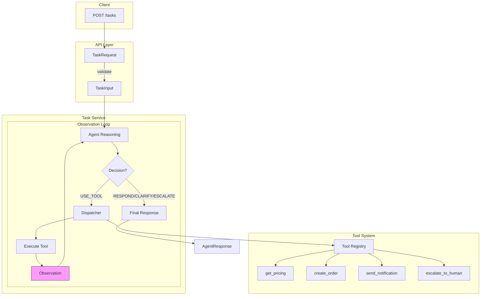

# Autonomous Task Agent

A **production-oriented autonomous AI agent** designed for business process automation and decision-making workflows.

## Overview

This system implements:

- 🤖 **Autonomous reasoning** — LLM-powered decision making with structured outputs
- 🔧 **Tool execution** — Validated, registry-based tool system
- 🔄 **Observation loop** — Multi-step workflows with feedback
- 🛡️ **Guardrails** — Retry logic, max iterations, graceful error handling
- 📊 **Structured logging** — Production-ready observability

## Architecture



### Decision Types

| Decision | Status | When Used |
|----------|--------|-----------|
| `RESPOND` | `success` | Agent has enough information to answer |
| `USE_TOOL` | `success`/`failed` | Agent needs to call an external tool |
| `CLARIFY` | `needs_input` | Agent needs more information |
| `ESCALATE` | `escalated` | Task requires human intervention |

## Quick Start

### Prerequisites

- Python 3.11+
- [uv](https://github.com/astral-sh/uv) package manager
- OpenAI API key

### Installation

```bash
# Clone the repository
git clone https://github.com/yourusername/autonomous-task-agent.git
cd autonomous-task-agent

# Install dependencies
make install-dev

# Configure environment
echo "OPENAI_API_KEY=sk-your-key-here" > .env

# Run tests
make test

# Start development server
make dev
```

### API Endpoints

| Endpoint | Method | Description |
|----------|--------|-------------|
| `/health` | GET | Liveness check |
| `/status` | GET | Agent configuration, available tools |
| `/tasks` | POST | Process a task through the agent |
| `/docs` | GET | Interactive API documentation (Swagger) |
| `/redoc` | GET | API documentation (ReDoc) |

## Available Tools

| Tool | Description | Side Effects |
|------|-------------|--------------|
| `get_pricing` | Look up product pricing | No |
| `create_order` | Create a new order | Yes |
| `send_notification` | Send email/SMS/Slack message | Yes |
| `escalate_to_human` | Hand off to human operator | Yes |

## Development

### Commands

```bash
make dev          # Start dev server with hot reload
make run          # Start production server
make test         # Run tests
make install-dev  # Install with dev dependencies
make docker-build # Build Docker image
make docker-up    # Run with docker-compose
make clean        # Clean cache files
```

## Design Philosophy

- **API-first backend architecture**
- **Explicit schemas over free-form text**
- **Deterministic control over agent execution**
- **Tools as first-class automation components**
- **No infinite loops or uncontrolled autonomy**
- **Decisions are explainable and traceable**