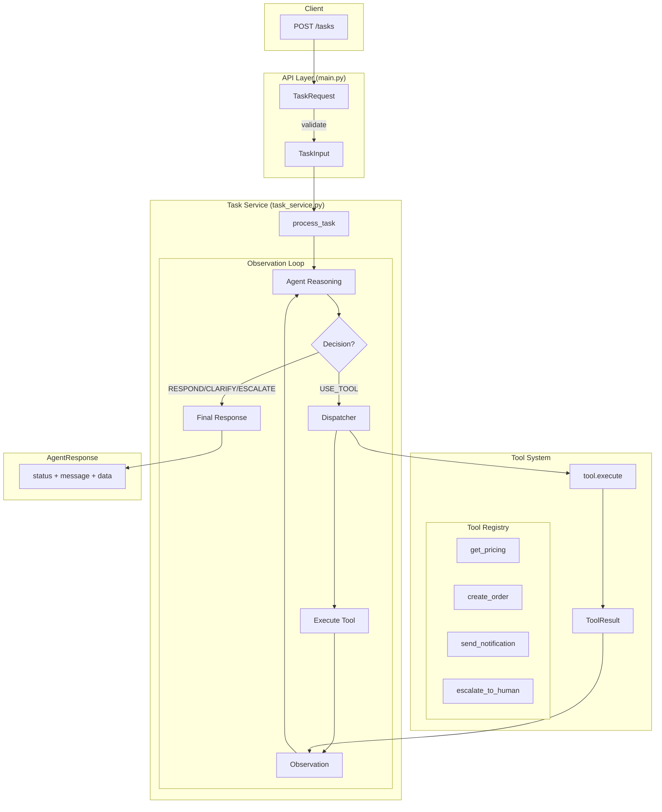
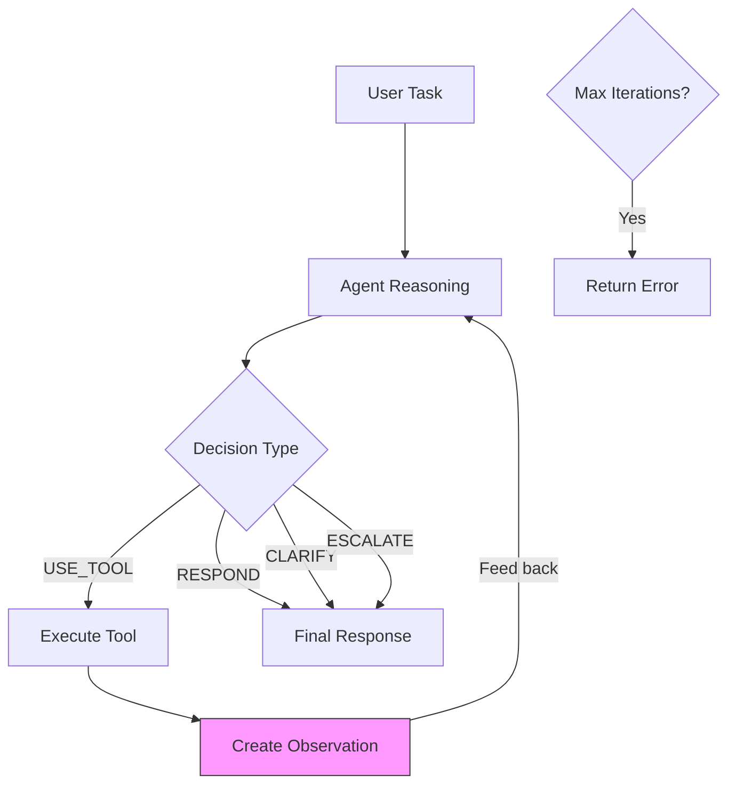
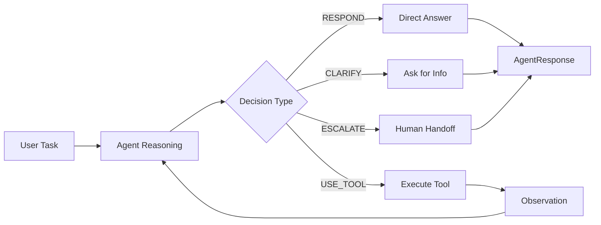
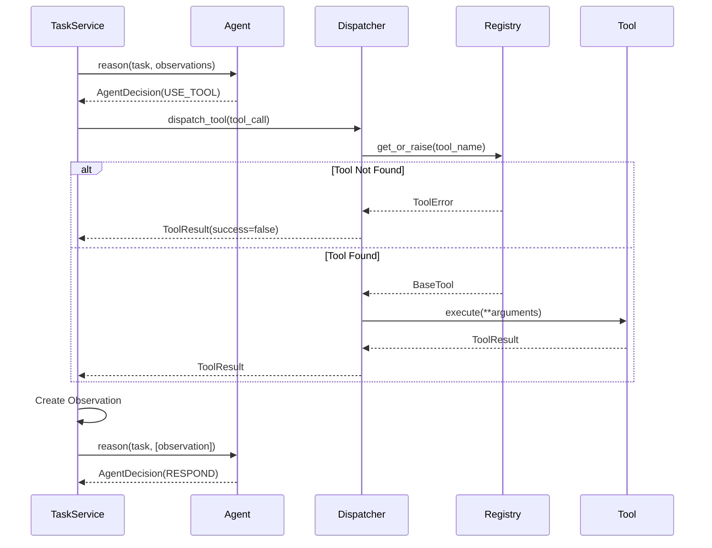

# Architecture Overview

## System Flow



## Observation Loop



The observation loop allows the agent to:
- **Chain multiple tool calls** — Get price, then create order
- **React to failures** — Try alternative approach
- **Craft informed responses** — Based on actual tool results
- **Safe execution** — Max 5 iterations prevents infinite loops

## Decision Flow



## Tool Execution



## Component Summary

| Component | File | Responsibility |
|-----------|------|----------------|
| **API Layer** | `main.py` | HTTP endpoints, request/response validation |
| **Task Service** | `task_service.py` | Observation loop, orchestrates agent + tools |
| **Reasoning Agent** | `reasoning.py` | LLM integration, accepts observations |
| **Prompts** | `prompts.py` | Dynamic system prompt with tool list |
| **Dispatcher** | `dispatcher.py` | Tool lookup and safe execution |
| **Tool Registry** | `tools/base.py` | Tool registration, prevents hallucination |
| **Tools** | `tools/*.py` | Individual tool implementations |
| **Schemas** | `schemas/task.py` | Pydantic models including Observation |
| **Config** | `config.py` | Environment settings |

## Schemas

| Schema | Purpose |
|--------|---------|
| `TaskInput` | What the agent receives |
| `AgentDecision` | Agent's structured decision (type, reasoning, tool_call, message) |
| `ToolCall` | Tool name + arguments |
| `Observation` | Tool execution result fed back to agent |
| `AgentResponse` | Final output (status, message, data) |

## Decision Types

| Decision | Status | When Used |
|----------|--------|-----------|
| `RESPOND` | `success` | Agent has enough information to answer directly |
| `USE_TOOL` | `success`/`failed` | Agent needs to call an external tool |
| `CLARIFY` | `needs_input` | Agent needs more information from user |
| `ESCALATE` | `escalated` | Task requires human intervention |

## Safety Guards

| Guard | Value | Purpose |
|-------|-------|---------|
| `MAX_ITERATIONS` | 5 | Prevents infinite tool loops |
| `MAX_PARSE_RETRIES` | 2 | Retries on malformed LLM output |
| `ToolRegistry` | — | Prevents hallucinated tool names |
| Pydantic validation | — | Validates all inputs/outputs |

## API Endpoints

| Endpoint | Method | Purpose |
|----------|--------|---------|
| `/health` | GET | Basic liveness check |
| `/status` | GET | Agent config, available tools |
| `/tasks` | POST | Process a task through the agent |

## Design Decisions & Trade-offs

### 1. Structured JSON Output vs Function Calling

**Decision:** Use prompt-based JSON output instead of OpenAI's native function calling.

**Trade-offs:**
- ✅ Model-agnostic (works with any LLM that outputs JSON)
- ✅ Full control over output schema
- ❌ Requires JSON parsing and retry logic
- ❌ Slightly less reliable than native function calling

**Rationale:** Portability and control outweigh the minor reliability cost. Retry logic mitigates parsing failures.

### 2. Observation Loop vs Single-Shot

**Decision:** Implement a multi-turn observation loop instead of single tool call.

**Trade-offs:**
- ✅ Enables multi-step workflows (get price → create order)
- ✅ Agent can react to tool failures
- ❌ Higher latency (multiple LLM calls)
- ❌ Higher token cost

**Rationale:** Business automation requires multi-step workflows. The MAX_ITERATIONS guard prevents runaway costs.

### 3. Tool Registry vs Dynamic Tool Discovery

**Decision:** Explicit tool registration in `__init__.py`.

**Trade-offs:**
- ✅ Prevents hallucinated tool names
- ✅ Clear, auditable list of capabilities
- ❌ Requires code change to add tools
- ❌ No runtime tool discovery

**Rationale:** For business automation, explicit > implicit. Security and predictability are priorities.

### 4. Pydantic Settings vs Raw Environment Variables

**Decision:** Use `pydantic-settings` for configuration.

**Trade-offs:**
- ✅ Type-safe configuration
- ✅ Automatic .env loading
- ✅ Fail-fast on missing required values
- ❌ Additional dependency

**Rationale:** Type safety and validation at startup prevent runtime configuration errors.

### 5. Synchronous API vs Async

**Decision:** Synchronous FastAPI endpoints (for now).

**Trade-offs:**
- ✅ Simpler code, easier debugging
- ✅ LangChain's sync API is more stable
- ❌ Lower throughput under load
- ❌ Blocking during LLM calls

**Rationale:** Simplicity for MVP. Async can be added in M9 (Production Readiness) if needed.

### 6. Centralized Task Service vs Distributed Handlers

**Decision:** Single `process_task()` function orchestrates everything.

**Trade-offs:**
- ✅ Easy to follow the flow
- ✅ Single place for logging and error handling
- ❌ Could become a "god function"
- ❌ Harder to test in isolation

**Rationale:** For current complexity, centralization aids understanding. Refactor when the service grows.

## Logging Strategy

All logs use structured format with `extra` dict for machine-readable fields:

```python
logger.info("task.complete", extra={
    "decision": "respond",
    "iterations": 2,
    "tools_called": 1,
    "duration_ms": 1234,
})
```

Log events follow `component.action` naming:
- `task.start`, `task.complete`, `task.error.*`
- `agent.reason.start`, `agent.reason.success`
- `agent.parse.retry`, `agent.llm.response`
