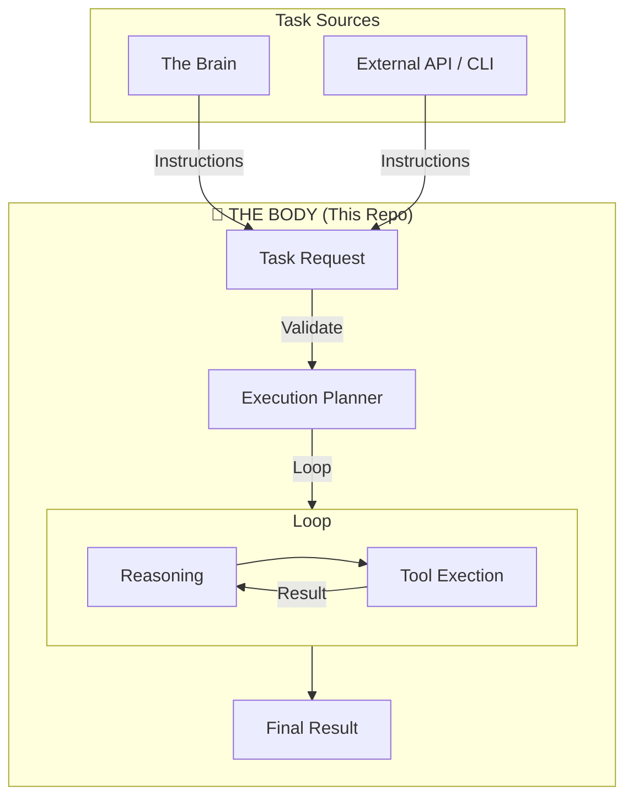

# Autonomous Task Agent (The Body)

**Role:** The Execution Engine
**Focus:** Action, Tools, Reliability

## Overview

This repository houses the **Execution Engine** of the ecosystem. Its primary purpose is to **act** upon the world safely and reliably. While the "Brain" (Deal Intelligence Platform) is a primary user, this agent is designed to be agnostic: it accepts tasks from **any source** (The Brain, CLI, API, or other agents).

It is built to be a reliable "Digital Employee" that follows instructions, uses tools (APIs), and recovers from errors without needing constant supervision.

> **Note:** This system does not perform deep long-horizon research or hold the primary knowledge base. It focuses on the mechanics of execution.

## Core Capabilities

1.  **Tool Use**: A robust registry of authenticated tools (.e.g, `get_pricing`, `create_order`, `send_email`).
2.  **Resilience Patterns**: Built-in support for retries, exponential backoff, and circuit breakers.
3.  **Human-in-the-Loop**:
    *   **Escalation**: Knowing when to ask for help using `escalate_to_human`.
    *   **Approval**: Pausing before dangerous actions (like `deployment` or `payment`).
4.  **Resilience**:
    *   Structured Logging for every "thought" and "action".
    *   Automatic retries for transient API failures.

## Architecture

## Documentation

- **[ROADMAP.md](./ROADMAP.md)**: The project roadmap.
- **[ARCHITECTURE.md](./ARCHITECTURE.md)**: Technical architecture and API documentation.